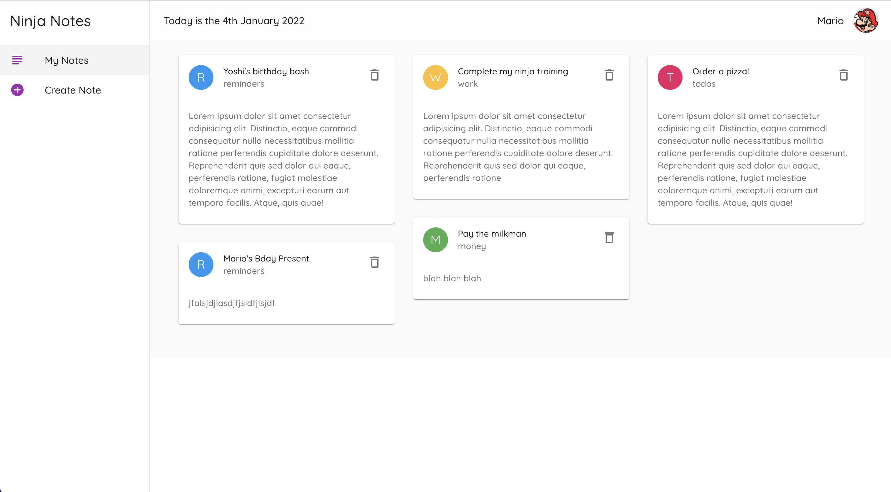

<h1 align="center">Welcome to my Material UI Tutorial React Project created by <a href="https://www.youtube.com/channel/UCW5YeuERMmlnqo4oq8vwUpg" target="_blank">The Net Ninja</a>👋</h1>
<p>
  
  <a href="#" target="_blank">
    
  </a>
</p>

## Screenshots



## What is this Project:

A hands-on React Notes application provided by the [The Net Ninja](https://www.youtube.com/channel/UCW5YeuERMmlnqo4oq8vwUpg) to serve as a Beginner's Guide for incorporating Material UI in React project.

## What the Project does:

Serves as an overview of Material UI and incorporate its components into a notes application. The application allows users to Create, Read, and Delete note cards.

## My reason for choosing this Project:

My goal is to build more CRUD applications faster by utilizing preexisting components instead of building CSS from scratch. Although I love CSS, it can be time-consuming, which isn't helpful on tight deadlines.

## What is Material UI:

A libary of accessible and customizable components that allows developers to build React applications faster

## Technologies:

- React
- Axios
- Material UI

## Install

```sh
npm install
npm install @material-ui/core
sudo npm install -g json-server
```

## Usage

```sh
npm run start

```

## Watch Json Server

```sh
json-server --watch data/db.json --port 8000

```

## Author

👤 **Michael Payne**

- Website: (https://michaelspayneii.com)
- Github: [@MSPayneII](https://github.com/MSPayneII)
- LinkedIn: [@michaelspayneii](https://linkedin.com/in/michaelspayneii)
